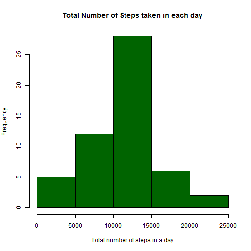
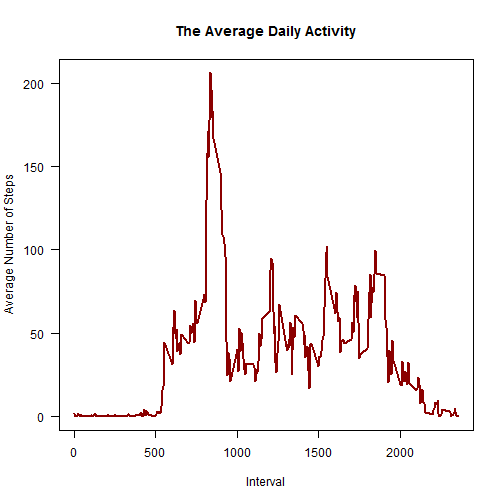
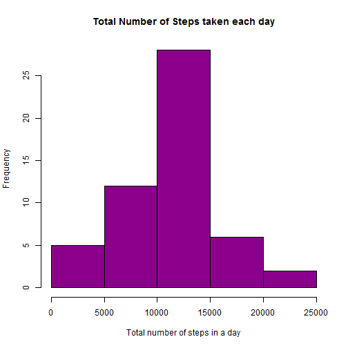
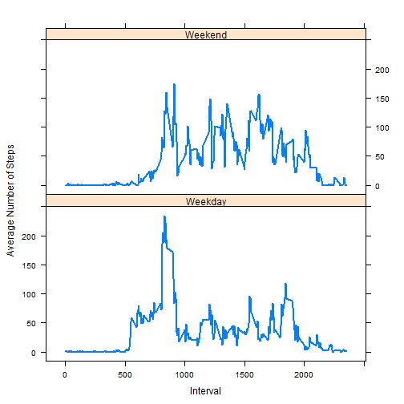

# Loading and preprocessing the data

Show any code that is needed to

1. Load the data (i.e. read.csv())


```r
ActivityData <- read.csv(FilePath, sep = ",")
```

2. Process/transform the data (if necessary) into a format suitable for your analysis

```r
ActivityData$date <- as.Date(ActivityData$date)
```

# What is mean total number of steps taken per day?

For this part of the assignment, you can ignore the missing values in the dataset.

1. Make a histogram of the total number of steps taken each day


```r
ActivityDataAgg <- aggregate(steps ~ date, ActivityData, sum)

hist(ActivityDataAgg$steps, main="Total Number of Steps taken in each day", 
     xlab="Total number of steps in a day", col = "darkgreen")
```



2. Calculate and report the mean and median total number of steps taken per day


```r
# Calculate the mean value
mean(ActivityDataAgg$steps)
```

```
## [1] 10766.19
```


```r
# Calculate the median value
median(ActivityDataAgg$steps)
```

```
## [1] 10765
```

# What is the average daily activity pattern?

1. Make a time series plot (i.e. type = "l") of the 5-minute interval (x-axis) and the average number of steps taken, averaged across all days (y-axis)


```r
# aggregate the data
ActivityDataAgg <- aggregate(steps ~ interval, ActivityData, mean)

# plot the data
plot(ActivityDataAgg$interval,ActivityDataAgg$steps, type = "l",
     lwd = 2, las = 1,col = "darkred",
     main = "The Average Daily Activity",
     xlab = "Interval", ylab = "Average Number of Steps")
```



2. Which 5-minute interval, on average across all the days in the dataset, contains the maximum number of steps?


```r
ActivityDataAgg[ActivityDataAgg$steps == max(ActivityDataAgg$steps), "interval"]
```

```
## [1] 835
```

# Imputing missing values

Note that there are a number of days/intervals where there are missing values (coded as NA). The presence of missing days may introduce bias into some calculations or summaries of the data.

1. Calculate and report the total number of missing values in the dataset (i.e. the total number of rows with NAs)

```r
# Total number of missing values
nrow(ActivityData[!complete.cases(ActivityData),])
```

```
## [1] 2304
```

2. Devise a strategy for filling in all of the missing values in the dataset. The strategy does not need to be sophisticated. For example, you could use the mean/median for that day, or the mean for that 5-minute interval, etc.

I'll use the mean for that 5-minute interval.

```r
# Separate the complete data from the original dataset 
completedata <- ActivityData[complete.cases(ActivityData),]

# Calculate the mean steps for each interval of the complete cases in the data set
CompleteStepsMean <- aggregate(steps ~ interval, completedata, mean)
```

3. Create a new dataset that is equal to the original dataset but with the missing data filled in.

```r
# Separate the missing data from the original dataset
missingdata <- ActivityData[!complete.cases(ActivityData),]

# Assign the mean value calculated above to the missed steps in the missing data set
reptime <- nrow(missingdata)/ nrow(CompleteStepsMean)
missingdata$steps <- rep(CompleteStepsMean$steps, times = reptime)
```

4. Make a histogram of the total number of steps taken each day and Calculate and report the mean and median total number of steps taken per day. Do these values differ from the estimates from the first part of the assignment? What is the impact of imputing missing data on the estimates of the total daily number of steps?

```r
# Bind the complete and missing data to create one dataset
missingdatafill <- rbind(completedata, missingdata)

ActivityDataAgg <- aggregate(steps ~ date, ActivityData, sum)

hist(ActivityDataAgg$steps, main="Total Number of Steps taken each day", 
     xlab="Total number of steps in a day", col = "darkmagenta")
```




```r
# Calculate the mean value
mean(ActivityDataAgg$steps)
```

```
## [1] 10766.19
```


```r
# Calculate the median value
median(ActivityDataAgg$steps)
```

```
## [1] 10765
```

Are there differences in activity patterns between weekdays and weekends?

For this part the weekdays() function may be of some help here. Use the dataset with the filled-in missing values for this part.

1. Create a new factor variable in the dataset with two levels - "weekday" and "weekend" indicating whether a given date is a weekday or weekend day.


```r
ActivityData$weekday <- weekdays(ActivityData$date)
ActivityData$daytype <- ifelse(ActivityData$weekday == "Saturday" | ActivityData$weekday == "Sunday", "Weekend", "Weekday")
ActivityData$daytype <- factor(ActivityData$daytype)
```

2. Make a panel plot containing a time series plot (i.e. type = "l") of the 5-minute interval (x-axis) and the average number of steps taken, averaged across all weekday days or weekend days (y-axis). See the README file in the GitHub repository to see an example of what this plot should look like using simulated data.


```r
ActivityDataAgg <- aggregate(steps ~ interval + daytype, ActivityData, mean)

# plot the data
library(lattice)
xyplot(steps ~ interval | daytype, data = ActivityDataAgg,type = "l",lwd = 2,
       xlab = "Interval" ,ylab = "Average Number of Steps", layout = c(1,2))
```




```r
#remove all list of objects
rm(list=ls())
```
